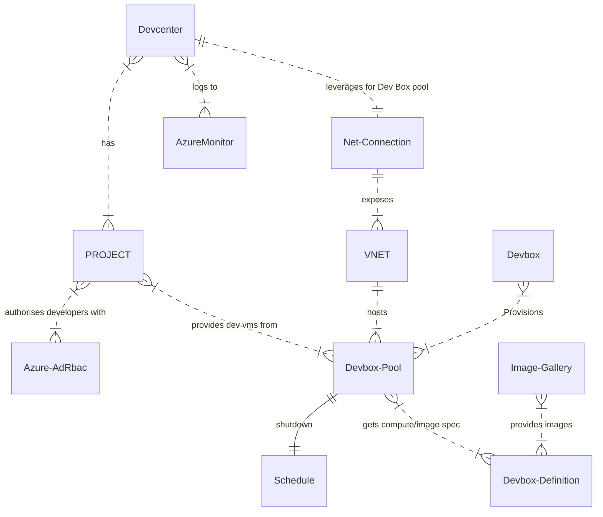
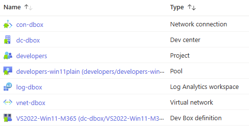
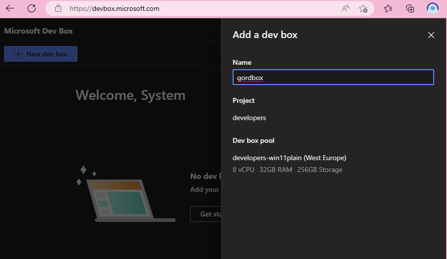
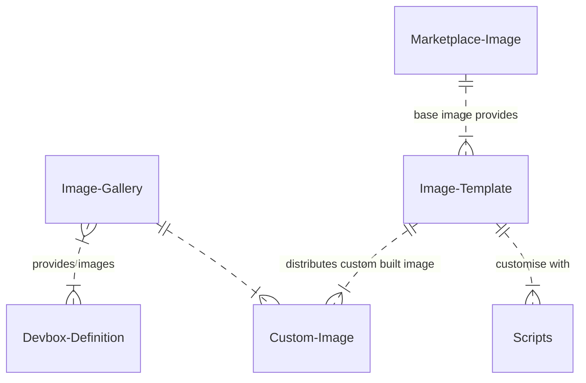

# Azure Devcenter Quickstart

This guide helps accelerate onboarding to the two Azure Services that Azure Devcenter enables by providing Bicep Infrastructure as Code to quickly deploy and configure the services.

1. [Microsoft Dev Box](https://learn.microsoft.com/azure/dev-box/overview-what-is-microsoft-dev-box) - Give your developers access to managed Windows Virtual Machines to code on
1. [Azure Deployment Environments](https://azure.microsoft.com/products/deployment-environments) - Provide curated Azure infra templates to your developers to *deploy* their code into

> Please note this repo is in active development, most scenarios are complete, but some have been flagged with `todo`

## Devcenter concepts

### Projects

Both Dev Box and Deployment Environments use several common Devcenter components to drive their experiences. Central to these is the concept of `Projects`. A project is what binds the developer access to developer workstations through Dev Box and the relevant templates from ADE.

### Azure Services

A typical Devcenter configuration depends on & integrates a lot of Azure Services. This can be a little confusing, but also takes time to correctly configure a working environment. The IaC in this repository provides the consistency of creation and configuration of all these components via 2-3 az cli commands.



## Prerequisites

Microsoft Dev Box has several license [prerequisites](https://learn.microsoft.com/azure/dev-box/quickstart-configure-dev-box-service?tabs=AzureADJoin#prerequisites). Namely Windows, InTune and AzureAD.

Your Azure AD tenant must be enabled for [auto-enrolment](https://learn.microsoft.com/mem/intune/enrollment/quickstart-setup-auto-enrollment) of new devices (InTune).

It doesn't work with invited (B2B) identities, so users will need to be directly associated with the tenant.

To complete the steps in this guide, you will need the Azure CLI and the GitHub CLI.

## Clone the repository

```bash
git clone https://github.com/Gordonby/Devcenter.git
cd Devcenter
```

## Deploy the common infrastructure

```bash
RG=devcenter

#Get the deploying users id for RBAC assignments
DEPLOYINGUSERID=$(az ad signed-in-user show --query id -o tsv)

#Create resource group
az group create -n $RG -l eastus

#Create devcenter common components
DCNAME=$(az deployment group create -g $RG -f bicep/common.bicep -p nameseed=devbox devboxProjectUser=$DEPLOYINGUSERID --query 'properties.outputs.devcenterName.value' -o tsv)
```


## Deploy Microsoft Dev Box Infrastructure

A fully working Dev Box requires a lot of connected components. The bicep IaC included in this repository will help expedite the creation of a functioning Dev Box environment.

```bash
az deployment group create -g $RG -f bicep/devbox.bicep -p devcenterName=$DCNAME
```

### Deployed Resources



### Create a Dev Box

Your Developers will access Dev Box resources through a dedicated portal; [https://aka.ms/devbox-portal](https://devbox.microsoft.com/)



## Azure Deployment Environments

`ADE section status : wip`

### Catalog repo

ADE requires a catalog in the form of a Git repository. The catalog contains IaC templates used to create environments.
To quickly get started with a sample catalog, use these commands to fork the [ADE](https://github.com/Azure/deployment-environments) repo using the GitHub CLI.

```bash
gh repo fork Azure/deployment-environments
```

> After creation of the repository, [create a PAT token](https://learn.microsoft.com/azure/deployment-environments/how-to-configure-catalog#create-a-personal-access-token-in-github) to allow ADE to gain access to these resources.

### ADE Infrastructure

Lets create the infrastructure components for ADE

```bash
PAT="paste-your-pat-token-here"
REPO="https://github.com/your-organization-name/deployment-environments.git"
az deployment group create -g $RG -f bicep/ade.bicep -p devcenterName=$DCNAME catalogRepoUri=$REPO catalogRepoPat=$PAT adeProjectUser=$DEPLOYINGUSERID
```

### Assign Access

The Devcenter uses a new managed identity to create Azure resources.
For any subscriptions that are to be used for ADE deployments RBAC assignments must be made.

```bash
CURRENTSUBID=$(az account show --query id -o tsv)
DEPLOYSUBID=$CURRENTSUBID
DEPLOYRG=deployrg

#create rbac

```

### Deploy an environment

Visit the [Developer Portal](https://devportal.microsoft.com) to deploy an environment.


## Advanced Deployment Scenarios - Dev Box

The IaC deployments above have used default parameter values to deploy a good sample configuration of Microsoft Dev Box and ADE. The IaC code is capable of deploying much more customized Devcenter environments as these samples show.

### Leveraging the Azure Image Builder

Working with the default Marketplace VM images for Dev Box provides a low complexity jumpstart for your dev team. The next step in providing tailored images with all the right software for your project is to produce custom images that contain all the tools and software needed.

Maintaining custom images can be time consuming, which is where the Azure Image Builder service comes in. It can be leveraged to take default MarketPlace images and layer on customization before distributing the image to a private compute gallery that integrates with Dev Box.

> The best thing about Azure Image Builder is the ability to layer on top of the Marketplace images with your own config, without needing to login to a VM.



To use IaC in creating the compute gallery and image build, run the following command;

```bash
az deployment group create -g $RG -f bicep/aib.bicep -p devcenterName=$DCNAME nameseed=devbox doBuildInAzureDeploymentScript=true
```

#### Initiating the Image Build

You can initiate the image build locally or in Azure using a DeploymentScript resource.

As a deployment output, it provides the exact commands to initiate the image build locally.


> Image Building takes time! You could find that 30-40 minutes later the build will be ready.

#### Further image customization

`todo`

#### Debugging build failures

A new resource group will be created during the Azure Image Build. It prefixes the name of the image template with `IT_`, and contains a storage account with a `customizations.log` file that you can check.

Start searching for the `ERROR:` keyword to stop what the problem is.

Common problems include

- Choosing a VM SKU that's incompatible with the Generation of Image you're using. EG 'Standard_D2_v3' and Gen2.

### Enrolling other developers

If you have a list of developers that you'd like to enrol, this script will expedite their access to create Dev Box.

```bash
DEVUSER=user@contoso.com
DEVUSERID=$(az ad user show --id $DEVUSER --query id -o tsv)
SUBID=$(az account show --query id -o tsv)
PROJECTNAME=developers
PROJECTID=/subscriptions/$SUBID/resourceGroups/$RG/providers/Microsoft.DevCenter/projects/$PROJECTNAME

#Dev box
az role assignment create --assignee $DEVUSER --role "DevCenter Dev Box User" --scope $PROJECTID

#Deployment Environment
az role assignment create --assignee $DEVUSER --role "Deployment Environments User" --scope $PROJECTID

```

### Deploying into an existing subnet

`todo`

## Resources

### Heritage

This repository continues the work started by Gordon in his [Devcenter IaC Repository](https://github.com/Gordonby/Devcenter)

### Complimentary labs

Summary | Link
------- | ----
Persona focussed lab, with Azure Portal screenshot walkthrough | [https://github.com/danielstocker/devboxlab](https://github.com/danielstocker/devboxlab)
Dev Box deployed using GitHub actions and bicep | [https://github.com/ljtill/bicep-devbox](https://github.com/ljtill/bicep-devbox)
